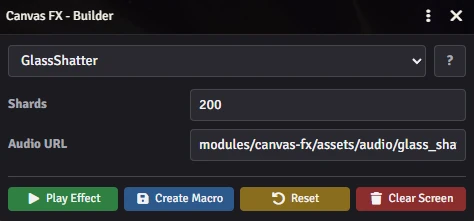
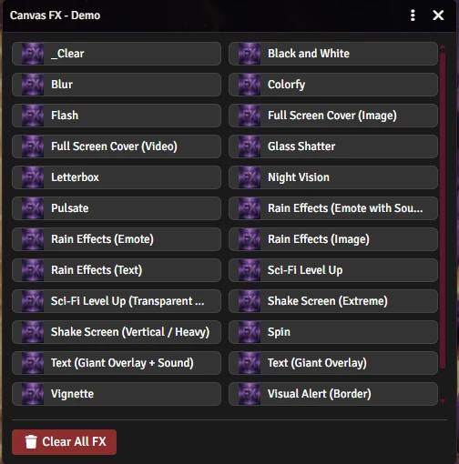

# Canvas FX

**Canvas FX** is a lightweight visual effects module designed exclusively for **Foundry VTT v14**. It allows Game Masters to trigger cinematic screen effects—like rain, shakes, flashes, and filters—that appear **above the UI** and synchronize instantly for all connected players.

[](https://buymeacoffee.com/mestredigital) [](https://mestredigital.online/pages/projetos-en)

---

## ⚠️ How to Use

**This module operates via Script Macros.**

To trigger effects during your game, you will need to create simple script macros. Don't worry if you don't know code—the documentation provides copy-and-paste examples for everything.

### 1. Explore & Test
Before writing your macros, you can use these internal tools to preview effects and understand how they look:

* **`CanvasFX.Builder()`** Opens a visual interface where you can tweak settings, play effects immediately, and **automatically create macros** with one click.
* **`CanvasFX.Demo()`** Opens a gallery of pre-configured examples to show you what is possible.

| Builder — tweak settings, play, and generate a macro | Demo — gallery of ready-made examples |
| :---: | :---: |
|  |  |

### 2. Create Your Effects
Once you have chosen an effect, refer to the **Wiki**. It contains the exact code snippets you need to copy into your macros to replicate the features listed below.

👉 **[Read the Wiki & API Reference](docs/wiki.md)**

---

## 📺 Video Example

<video src="https://github.com/user-attachments/assets/e81c608f-982a-4c8d-8093-0d4c9576c966" 
       controls 
       width="720"
       autoplay 
       loop 
       muted></video>

---

## ✨ Features

By using the simple commands found in the Wiki, you can create:

* **🌧️ Particles:** Rain emojis (🔥, ❄️, 💰), text, or custom images.
* **💥 Impact:** Screen shakes, glass shattering simulations, and bright flashes (lightning/explosions).
* **🎬 Cinematics:** Cinematic "Letterbox" bars, theater curtains, **slideshows**, or full-screen image/video covers.
* **🎨 Filters:** Full-screen effects like **Blur**, **Night Vision**, **Black & White**, **Vignette**, or Color Tints.
* **📢 Alerts:** Giant animated text overlays (Pulse/Shake), pulsing screen borders (Low Health), or **dramatic countdowns**.
* **🔄 Motion:** Screen spinning or pulsating (heartbeat effect).
* **🚀 Sci-Fi:** A 3D holographic "Level Up" HUD (Three.js) where the text erupts into particles once fully formed, with a solid black backdrop by default (transparent mode also available).
* **🔊 Audio:** Automatic sound synchronization with visual triggers.

---

## 📥 Manual Installation

1.  Copy this manifest link:

```
https://raw.githubusercontent.com/brunocalado/canvas-fx/main/module.json
```
    
2.  In Foundry VTT, go to **Add-on Modules** -> **Install Module**.
3.  Paste the link into the **Manifest URL** field and click Install.

---

## License

Code licensed under [LICENSE](LICENSE).

*Images and audio assets are public domain (CC0).*

*Bundles [Three.js](https://threejs.org) (MIT, see `lib/LICENSE-three.md`) for the 3D effects.*